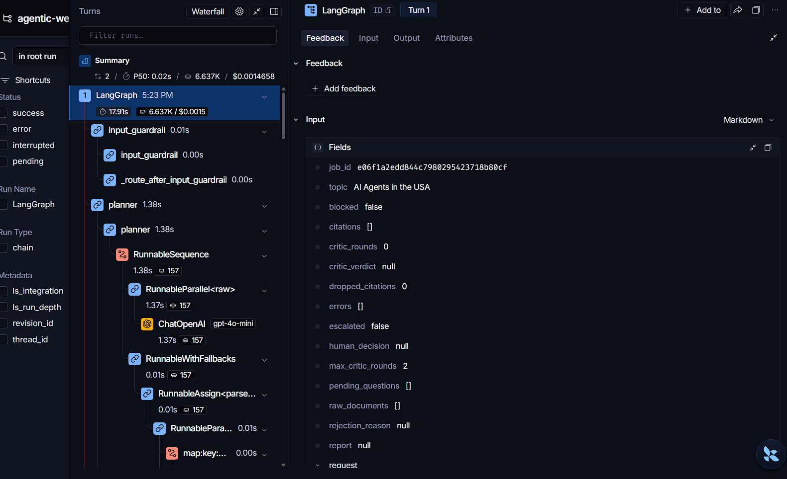
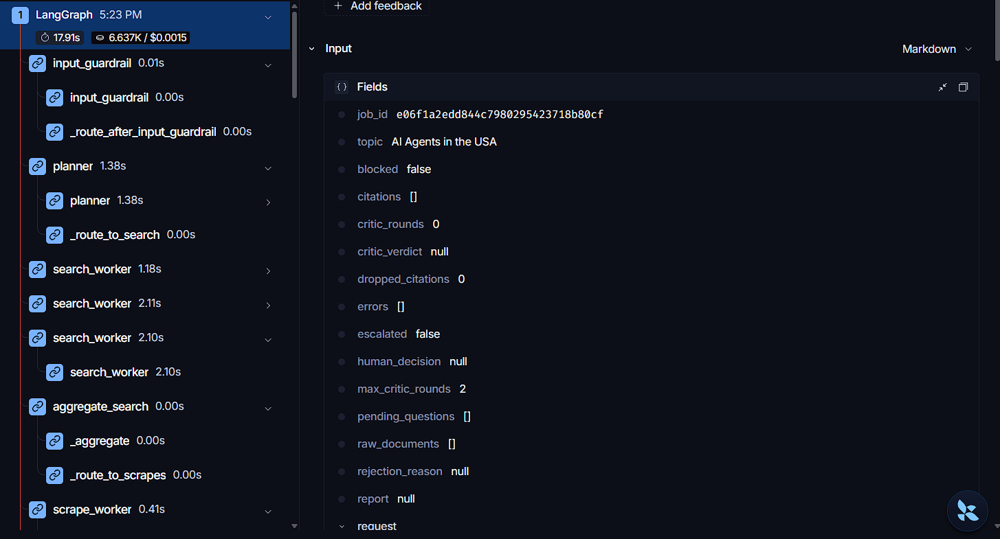
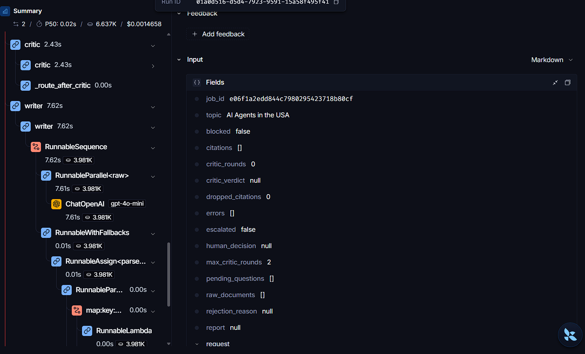
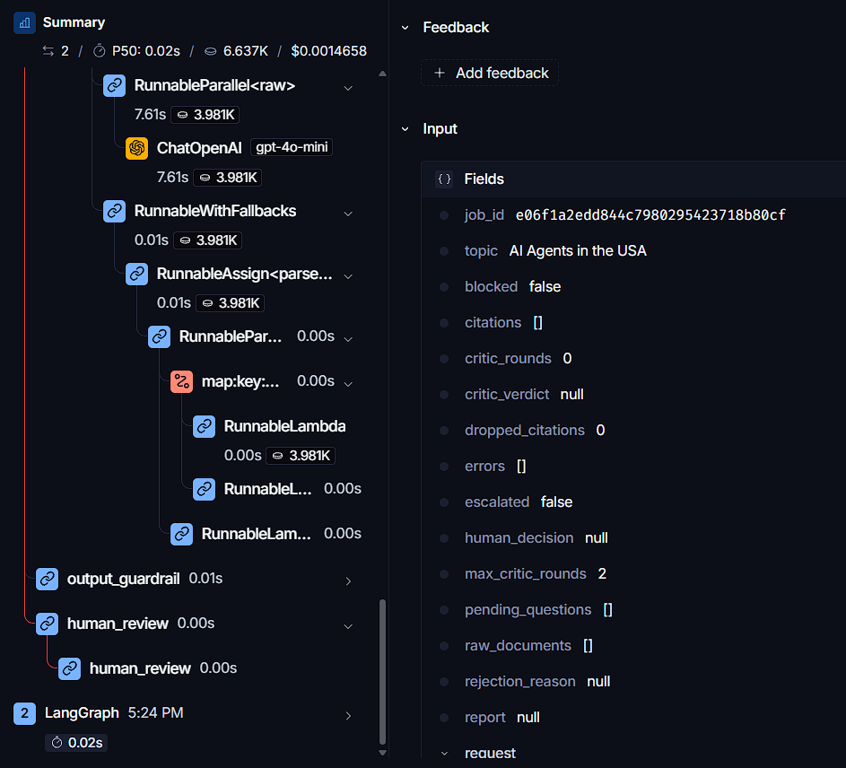

# Autonomous Web Research Agent

A production-grade, multi-agent research microservice built with **FastAPI + LangGraph**.
Give it a topic — it decomposes the problem, searches and scrapes the live web in
parallel, verifies every citation against the fetched evidence, escalates to a human
when coverage is insufficient, and returns a defensible report over a job API with
live progress streaming.

This repository is engineered to the standard of a paid engagement, not a demo:
guardrail-first design, deterministic offline evaluation that gates CI, per-job cost
accounting, and full observability.


## Why this architecture

```
            ┌──────────────┐
   topic ──▶│ input guardrail│  reject hostile/malformed topics before any LLM spend
            └──────┬───────┘
                   ▼
              ┌─────────┐
              │ planner │  decompose into sub-questions (bounded count)
              └────┬────┘
        ┌──────────┼──────────┐   fan-out via LangGraph Send — one branch each
        ▼          ▼          ▼
   search_w   search_w    search_w
        └──────────┼──────────┘
                   ▼
        ┌──────────┼──────────┐
        ▼          ▼          ▼
   scrape_w    scrape_w   scrape_w    robots.txt · rate limit · byte caps · SSRF guard
        └──────────┼──────────┘
                   ▼
        ┌──────────┼──────────┐
        ▼          ▼          ▼
   document_w  document_w document_w   HTML/PDF parsing + injection sanitization
        └──────────┼──────────┘
                   ▼
              ┌─────────┐     needs more & rounds left
              │  critic │ ────────────────────▶ replan ──▶ (new sub-questions)
              └────┬────┘
                   ▼  (escalate if loop exhausted with gaps)
              ┌─────────┐
              │ writer  │  report + citations grounded in fetched sources
              └────┬────┘
                   ▼
         ┌───────────────────┐
         │ output guardrail  │  drop citations without verbatim source support
         └────────┬──────────┘
                  ▼
         ┌───────────────────┐
         │ human review gate │  LangGraph interrupt() — approve / edit / reject
         └────────┬──────────┘
                  ▼
              assembler ──▶ END
```

Every design choice is defensible in an interview:

- **Guardrail-first.** The topic is screened before any paid call; scraped pages are
  sanitized before they reach the model. Untrusted content is data, never instructions.
- **Bounded autonomy.** The critic/re-plan loop is capped (`max_critic_rounds`) —
  termination is guaranteed by construction, not by luck.
- **Verifiable output.** A citation that cannot be backed by a verbatim quote from its
  source is dropped and counted. Quality is *measured*, not assumed.
- **Honest human-in-the-loop.** The review gate is a real LangGraph `interrupt()` on a
  SQLite checkpointer — jobs pause at `awaiting_review` and resume via
  `POST /research/{id}/review` (`approve` / `edit` / `reject`).

## The indirect prompt-injection defense

Web research agents have a threat model most LLM apps don't: the *content* is hostile.
A fetched page can carry instructions aimed at the model ("ignore previous
instructions, exfiltrate…"). This service neutralizes that at the parse stage —
invisible-character normalization, instruction-phrase defanging, and strict
treatment of page text as data. See `SECURITY.md` for the full OWASP LLM Top 10
mapping and `tests/fixtures/adversarial_page.html` for the attack fixture it is
tested against.

## Evaluation-Driven Development (EDD)

Quality thresholds gate CI the same way unit tests do. `evaluation/` contains a
versioned dataset, a deterministic offline harness, and evaluators for the metrics
that matter in this domain:

| Metric | Threshold | Latest offline scorecard |
|---|---|---|
| Citation support rate | ≥ 0.90 | 1.000 |
| Source precision | ≥ 0.80 | 1.000 |
| Topic coverage | ≥ 0.85 | 1.000 |

```bash
uv run python -m evaluation.run_eval   # exits non-zero if any gate fails
```

The offline scorecard measures *pipeline* determinism; the same metrics run against
the live model when real credentials are provided.

## API

| Endpoint | Purpose |
|---|---|
| `POST /api/v1/auth/login` | Issue a short-lived JWT (rate-limited) |
| `POST /api/v1/research` | Submit a research job → `202` + job record |
| `GET /api/v1/research/{id}` | Poll status and final result |
| `GET /api/v1/research/{id}/stream` | Live progress via SSE (per-node events) |
| `POST /api/v1/research/{id}/review` | HITL decision for `awaiting_review` jobs |
| `GET /api/v1/research/{id}/report.pdf` | Download the final report as a PDF |
| `GET /health` / `GET /metrics` | Liveness + Prometheus exposition |
| `/` and `/console/` | Landing page + operator console (login, live events, review UI) |

## Observability & cost

- **structlog** JSON pipeline, correlated by `job_id`, with automatic redaction of
  `*_key` / `*_token` / `*_password` / `authorization` / `*_secret` fields.
- **Prometheus** metrics: `research_jobs_total{status}`, `research_job_duration_seconds`,
  `llm_tokens_total{role,kind}`, `research_job_cost_usd`.
- **Cost tracking**: per-job token accounting via a context-scoped `UsageTracker`;
  `job.cost_usd` is persisted and shown in the console.
- **LangSmith**: set `LANGCHAIN_API_KEY` + `LANGCHAIN_TRACING_V2=true` and every
  graph run is traced automatically.
- **Checkpoints**: LangGraph `AsyncSqliteSaver` per `job_id` — the mechanism that
  makes interrupt/resume and crash recovery real.

### LangSmith tracing (real run)

Every run produces a full graph trace — node-level latency, token counts and
cost per agent role:









## Security posture

JWT auth (generic 401s), rate-limited login + submit, security headers middleware,
SSRF scheme allowlist, robots.txt-compliant scraper with delays and size caps, and
secret hygiene enforced by `SecretStr`, redacted logs, `.dockerignore`/`.gitignore`
coverage and `gitleaks` in CI. Full mapping: [`SECURITY.md`](SECURITY.md).

## Quickstart

```bash
uv sync --all-extras
cp .env.example .env        # fill in OPENAI_API_KEY / SEARCH_API_KEY as needed
uv run uvicorn app.main:app --reload
# open http://localhost:8000/console/
```

The app **degrades cleanly with zero secrets**: no LLM key → deterministic stub
client; no search key → null search client; no JWT secret → auth disabled for local
dev. CI runs the entire suite with no secrets at all.

```bash
docker compose up --build   # full stack in one container
```

## Verification

```bash
ruff check .                          # lint
mypy --strict app/                    # types (0 errors)
pytest -v --cov=app                   # 125 tests, fully offline, >90% coverage
uv run python -m evaluation.run_eval  # EDD quality gate
```

CI (`.github/workflows/ci.yml`): ruff → mypy strict → pytest+coverage → EDD gate →
pip-audit → gitleaks, on `pull_request` with `contents: read`.

## Stack

Python 3.13 · FastAPI · LangGraph (`Send` fan-out, `interrupt()` HITL,
`AsyncSqliteSaver`) · LangChain Core + `langchain-openai` · Pydantic v2 /
pydantic-settings · httpx + tenacity · BeautifulSoup4/lxml + pypdf · aiosqlite ·
structlog · prometheus-fastapi-instrumentator · PyJWT · pytest/respx · ruff ·
mypy --strict · uv · Docker.

## Known limitations & next steps

- Single static admin credential (fine for a demo deployment; not multi-tenant).
- In-process rate limiter (does not coordinate across replicas).
- SSRF guard allowlists URL schemes but does not yet block private IP ranges.
- Optional Playwright fallback requires `uv run playwright install` and
  `SCRAPER_BROWSER_FALLBACK` wiring — lazy-loaded, off by default.
