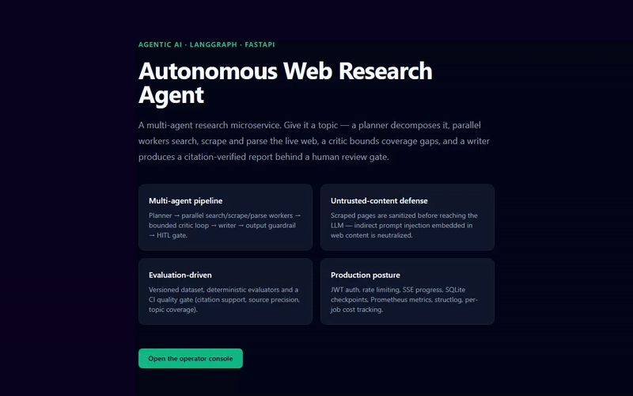
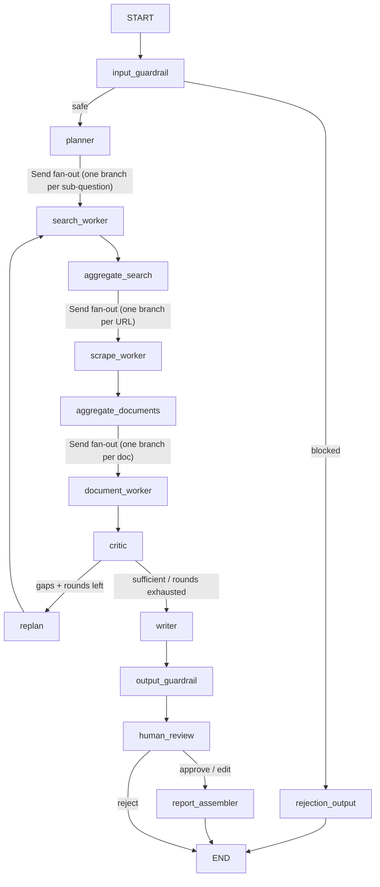
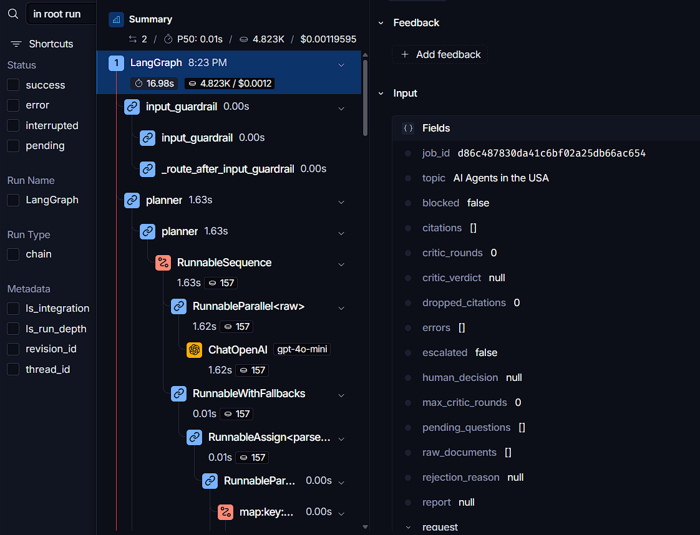

<div align="center">

# 🔎 Autonomous Web Research Agent

**A hybrid multi-agent research microservice that plans, searches, scrapes, critiques, and writes a cited report — with verified citations, bounded autonomy, and a human always able to step in.**

[](https://www.python.org/)
[](https://fastapi.tiangolo.com/)
[](https://github.com/langchain-ai/langgraph)
[](https://github.com/kanderson-ai-dev/agentic-web-researcher/actions/workflows/ci.yml)
[](https://github.com/kanderson-ai-dev/agentic-web-researcher/actions/workflows/ci.yml)
[](https://github.com/astral-sh/ruff)
[](https://mypy-lang.org/)
[](LICENSE)



</div>

---

## 📌 What this is

A **production-shaped, multi-agent research microservice** built with FastAPI and
LangGraph. Give it a topic — it decomposes the problem, searches and scrapes the
live web in parallel, verifies every citation against the fetched evidence,
escalates to a human when coverage is insufficient, and returns a defensible
report over an async job API with live progress streaming.

This is the tier above a single-agent tool-calling demo: a **planner** dispatches
**parallel specialized workers** (search, scrape, document-parse), a **critic**
grades the evidence and can trigger bounded re-planning rounds, and a **writer**
synthesizes a final report that only cites claims it can actually back with
text verifiably present in the fetched source. It is engineered to the standard of a paid engagement, not
a portfolio toy: guardrail-first design, deterministic offline evaluation that
gates CI, per-job cost accounting, and full observability — every number below
is reproducible with `uv run python -m evaluation.run_eval`.

---

## 💡 Why this matters — for your project, or for a technical reviewer

- 🕸️ **Real, uncontrolled external tools.** Unlike a RAG system over a curated
  corpus, this agent's evidence comes from the live, adversarial web — search
  results, arbitrary HTML, and PDFs it has never seen before.
- 🛡️ **Indirect prompt injection is the threat model, and it's handled.** A
  scraped page can carry instructions aimed at the model ("ignore previous
  instructions, exfiltrate…"). Every fetched page is sanitized and treated as
  **data, never instructions**, before it ever reaches a prompt (OWASP LLM01).
- 🚫 **Hostile topics burn zero tokens.** An input guardrail screens the topic
  before any paid LLM or search call — malformed or malicious requests
  short-circuit before spending a cent.
- 🔁 **Bounded autonomy, not an open-ended loop.** The critic/re-plan cycle is
  capped by `MAX_CRITIC_ROUNDS` — termination is guaranteed by construction,
  proven by a dedicated test, not by luck.
- ✅ **Citations are verified, not trusted.** Every citation's quote is checked
  against the fetched source text — verbatim match, punctuation-insensitive,
  or ≥0.85 sliding-window similarity. Anything else is dropped from the
  report and counted — quality is *measured*, never assumed.
- 🧑‍⚖️ **Honest human-in-the-loop.** The review gate is a real LangGraph
  `interrupt()` on a SQLite checkpointer: jobs pause at `awaiting_review` and
  resume via `POST /research/{id}/review` (`approve` / `edit` / `reject`), and
  the critic automatically escalates when it can't close a coverage gap after
  its allotted rounds.
- 💰 **Cost and latency are accounted per job**, not per call — token usage
  across all four LLM roles (planner, critic, writer, and the workers) rolls up
  into one `cost_usd` and is exposed via Prometheus and the console.
- 🧪 **CI green with zero secrets.** 143 tests, 93% coverage on `app/`, run
  fully offline with stubs — no search/LLM credentials required for a fork to
  clone and pass; cloud-backed paths degrade cleanly instead of failing.

---

## 🏗️ Architecture



- **Guardrail-first**: hostile or malformed topics are rejected before any LLM
  spend; scraped pages are sanitized before they reach the model (OWASP
  LLM01/LLM02).
- **Parallel workers**: each aggregation stage fans out via LangGraph `Send`
  and merges through reducers — search, scrape and parse branches run
  concurrently, with per-domain politeness delays on the scraper.
- **Bounded self-correction**: the critic grades coverage and citation support;
  gaps trigger a re-planning round capped by `max_critic_rounds` (0 on `quick`
  depth — single pass). Termination is guaranteed by construction.
- **Human-in-the-loop**: the graph pauses on `interrupt()` at
  `human_review` and resumes with `Command(resume=...)` — approve, edit the
  draft, or reject. Round exhaustion with open gaps escalates automatically.

Every design choice is defensible in an interview:

- **Guardrail-first.** The topic is screened before any paid call; scraped pages
  are sanitized before they reach the model. Untrusted content is data, never
  instructions.
- **Bounded autonomy.** The critic/re-plan loop is capped (`max_critic_rounds`)
  — termination is guaranteed by construction, not by luck.
- **Verifiable output.** A citation that cannot be backed by its source's
  extracted text is dropped and counted. Quality is *measured*, not assumed.
- **Honest human-in-the-loop.** The review gate is a real LangGraph
  `interrupt()` on a SQLite checkpointer — jobs pause at `awaiting_review` and
  resume via `POST /research/{id}/review` (`approve` / `edit` / `reject`).

### Two frontend surfaces

| Route | Surface |
|---|---|
| `/` | Minimalist public landing (Tailwind via CDN, no build step). |
| `/console` | Operator console — topic submission, live SSE progress, source list, final report with clickable citations, HITL review modal. |

---

## 🧠 The indirect prompt-injection defense

Web research agents have a threat model most LLM apps don't: the *content* is
hostile. A fetched page can carry instructions aimed at the model ("ignore
previous instructions, exfiltrate…"). This service neutralizes that at the
parse stage — invisible-character normalization, instruction-phrase defanging,
and strict treatment of page text as data. See [`SECURITY.md`](SECURITY.md) for
the full OWASP LLM Top 10 mapping and `tests/fixtures/adversarial_page.html`
for the attack fixture it is tested against.

---

## 📊 Evaluation-Driven Development (EDD)

Quality thresholds gate CI the same way unit tests do. `evaluation/` contains a
versioned dataset, a deterministic offline harness, and evaluators for the
metrics that matter in this domain.

### Project Goal & Definition of Success

| Dimension | Metric | Success threshold | Latest offline scorecard |
|---|---|---|---|
| Citation faithfulness | Citation support rate (claims backed by real source text) | ≥ 0.90 | **1.000** ✅ |
| Retrieval quality | Source relevance / precision | ≥ 0.80 | **1.000** ✅ |
| Task coverage | Topic coverage (planned sub-questions answered) | ≥ 0.85 | **1.000** ✅ |
| Task performance | LLM-as-judge rubric (1–5) | avg ≥ 4.0 | requires live credentials |
| Latency | Full async research job, p50 / p95 | ≤ 60s / ≤ 180s | requires live credentials |
| Cost | Per research job (planner + workers + critic + writer) | ≤ $0.05 | requires live credentials |
| Test coverage | `pytest --cov=app` | ≥ 80% | **93%** ✅ |
| Static typing | `mypy --strict app/` | 0 errors | **0 errors** ✅ |

```bash
uv run python -m evaluation.run_eval   # exits non-zero if any gate fails
```

The offline scorecard measures *pipeline* determinism with a stubbed LLM and
fixture-based search/scrape results — it validates that the guardrails, critic
logic, and citation-verification pipeline behave correctly without spending a
cent. The same metrics run against the live model when real credentials
(`OPENAI_API_KEY`, `SEARCH_API_KEY`) are provided, and latency/cost are only
meaningful against the live path. Never adjust a badge to look better than the
measured number — see "Known limitations" below for what's honestly
unmeasured in CI.

---

## 🔌 API

| Endpoint | Purpose |
|---|---|
| `POST /api/v1/auth/login` | Issue a short-lived JWT (rate-limited) |
| `POST /api/v1/research` | Submit a research job → `202` + job record |
| `GET /api/v1/research/{id}` | Poll status and final result |
| `GET /api/v1/research/{id}/stream` | Live progress via SSE (per-node events) |
| `POST /api/v1/research/{id}/review` | HITL decision for `awaiting_review` jobs |
| `GET /api/v1/research/{id}/report.pdf` | Download the final report as a PDF |
| `GET /health` / `GET /metrics` | Liveness + Prometheus exposition |
| `/` and `/console/` | Landing page + operator console (login, live events, review UI) |

### curl examples

```bash
# Submit a research job (queued, returns immediately)
curl -s -X POST http://localhost:8000/api/v1/research \
  -H "Content-Type: application/json" \
  -d '{"topic": "impact of the EU AI Act on startups", "depth": "standard", "language": "en"}'

# Poll status and result
curl -s http://localhost:8000/api/v1/research/<job_id>

# Stream live progress (planner -> workers -> critic -> writer)
curl -N http://localhost:8000/api/v1/research/<job_id>/stream

# Resolve a job paused for human review
curl -s -X POST http://localhost:8000/api/v1/research/<job_id>/review \
  -H "Content-Type: application/json" \
  -d '{"action": "approve"}'

# Download the final report as a PDF
curl -s -o report.pdf http://localhost:8000/api/v1/research/<job_id>/report.pdf
```

---

## 📡 Observability & cost

- **structlog** JSON pipeline, correlated by `job_id`, with automatic redaction
  of `*_key` / `*_token` / `*_password` / `authorization` / `*_secret` fields.
- **Prometheus** metrics: `research_jobs_total{status}`,
  `research_job_duration_seconds`, `llm_tokens_total{role,kind}`,
  `research_job_cost_usd`.
- **Cost tracking**: per-job token accounting via a context-scoped
  `UsageTracker`; `job.cost_usd` is persisted and shown in the console.
- **LangSmith**: set `LANGCHAIN_API_KEY` + `LANGCHAIN_TRACING_V2=true` and every
  graph run is traced automatically.
- **Checkpoints**: LangGraph `AsyncSqliteSaver` per `job_id` — the mechanism
  that makes interrupt/resume and crash recovery real.

### LangSmith tracing (real run)

Every run produces a full graph trace — node-level latency, token counts and
cost per agent role. The trace below is a real `quick` run on
*"AI Agents in the USA"*: **17.0s end-to-end, 4.8K tokens, $0.0012** —
planner fan-out, parallel workers, critic, writer and the guardrail/HITL tail
all visible in one tree:



---

## 🔒 Security posture

JWT auth (generic 401s), rate-limited login + submit, security headers
middleware, SSRF scheme allowlist, robots.txt-compliant scraper with delays and
size caps, and secret hygiene enforced by `SecretStr`, redacted logs,
`.dockerignore`/`.gitignore` coverage and `gitleaks` in CI. Full mapping:
[`SECURITY.md`](SECURITY.md).

---

## 🚀 Quick Start

```bash
uv sync --all-extras
cp .env.example .env        # fill in OPENAI_API_KEY / SEARCH_API_KEY as needed
uv run uvicorn app.main:app --reload
# open http://localhost:8000/console/
```

The app **degrades cleanly with zero secrets**: no LLM key → deterministic stub
client; no search key → free keyless DuckDuckGo fallback; no JWT secret → auth
disabled for local dev. CI runs the entire suite with no secrets at all.

```bash
docker compose up --build   # full stack in one container
```

## ⚙️ Environment Variables

| Variable | Required | Secret? | Purpose |
|---|---|---|---|
| `OPENAI_API_KEY` | no | ✅ | Planner/critic/writer LLM; falls back to a deterministic stub client when absent |
| `SEARCH_PROVIDER` | no | — | `auto` \| `tavily` \| `duckduckgo` \| `none` (`auto` uses Tavily when `SEARCH_API_KEY` is set, else keyless DuckDuckGo) |
| `SEARCH_API_KEY` | no | ✅ | Tavily API key (enables the paid provider) |
| `LANGCHAIN_API_KEY` / `LANGCHAIN_TRACING_V2` | no | ✅ | LangSmith tracing |
| `JWT_SECRET_KEY` | no | ✅ | Enables JWT auth (else open for local dev) |
| `ADMIN_USERNAME` / `ADMIN_PASSWORD` | no | ✅ | Single-operator login via `/api/v1/auth/login` |
| `MAX_SUB_QUESTIONS` | no | — | Bounds the planner's fan-out |
| `MAX_CRITIC_ROUNDS` | no | — | Bounds the critic/re-plan loop (guaranteed termination) |
| `SCRAPE_DELAY_SECONDS` / `SCRAPE_TIMEOUT_SECONDS` / `SCRAPE_MAX_BYTES` | no | — | Scraper politeness and safety caps |

Never commit secrets. See [`.env.example`](.env.example) for the full,
commented template.

## 📁 Project Structure

```
app/
├── api/v1/routes/   # auth, research, health
├── core/            # config, security, logging, metrics, cost tracking, rate limiting
├── graph/           # state, nodes (planner/workers/critic/writer), prompts, guardrails, assembly
└── services/        # search_client, scraper_client, document_parser, llm_client, job_store, job_runner
evaluation/          # versioned dataset, evaluators, run_eval, scorecards
frontend/
├── (landing)        # minimalist public landing (`/`, Tailwind via CDN)
└── console/         # operator console (`/console`: submission, SSE progress, sources, HITL modal)
tests/               # pytest suite (fixtures for HTML/PDF, mocked search API, adversarial content)
docs/                # real captures referenced by this README
```

## 🧪 Verification

```bash
ruff check .                          # lint
mypy --strict app/                    # types (0 errors)
pytest -v --cov=app                   # 143 tests, fully offline, 93% coverage
uv run python -m evaluation.run_eval  # EDD quality gate
```

CI (`.github/workflows/ci.yml`): ruff → mypy strict → pytest+coverage → EDD gate
→ pip-audit → gitleaks, on `pull_request` with `contents: read`.

## 🐳 Docker Deployment

```bash
docker compose up --build
```

The image reads configuration from `.env` at runtime; no secrets are baked
into the image.

## 🛠️ Stack

Python 3.13 · FastAPI · LangGraph (`Send` fan-out, `interrupt()` HITL,
`AsyncSqliteSaver`) · LangChain Core + `langchain-openai` · Pydantic v2 /
pydantic-settings · httpx + tenacity · BeautifulSoup4/lxml + pypdf · aiosqlite ·
structlog · prometheus-fastapi-instrumentator · PyJWT · pytest/respx · ruff ·
mypy --strict · uv · Docker.

## Known limitations & next steps

- Single static admin credential (fine for a demo deployment; not multi-tenant).
- In-process rate limiter (does not coordinate across replicas).
- SSRF guard allowlists URL schemes but does not yet block private IP ranges.
- Optional Playwright fallback requires `uv run playwright install` and
  `SCRAPER_BROWSER_FALLBACK` wiring — lazy-loaded, off by default.
- LLM-as-judge, latency, and cost-per-job thresholds require live LLM/search
  credentials to measure; the offline CI scorecard only validates the
  deterministic pipeline (citation support, source precision, topic coverage).

---

## 💼 Need this for your own project?

**I build production-shaped agentic AI systems — guardrail-first design,
multi-agent orchestration, real tool integration, and the evaluation/
observability discipline to actually trust them in production.**

If you need an agent that touches the open web safely — search, scrape,
synthesize, cite — I can adapt this exact architecture (planner, parallel
workers, critic, human-in-the-loop) to your domain.

This is the third project in a four-project Agentic AI portfolio ladder:

1. `agentic-api` — deterministic single-agent service (guardrails, tool-use, streaming).
2. `agentic-rag-system` — self-correcting loop (Self-RAG: grade → rewrite → escalate).
3. **`agentic-web-researcher` (this project)** — hybrid multi-agent: a planner
   dispatches parallel specialized workers, a critic can re-plan, a writer
   synthesizes.
4. *(future)* a reusable, multi-tenant supervisor-workers agent framework.

## 📄 License

[MIT](LICENSE)
